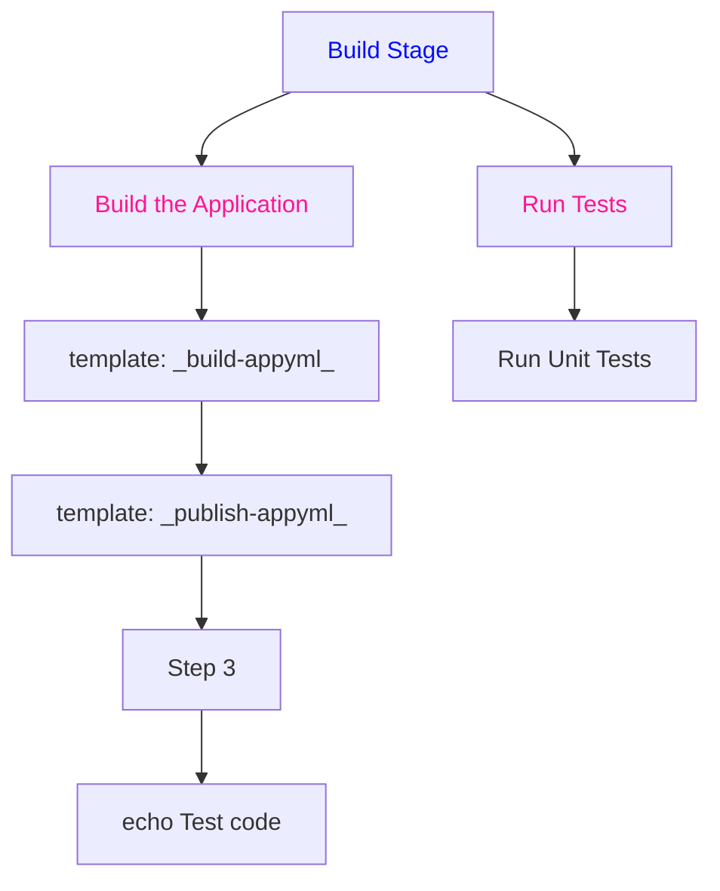

# Azure Pipeline Documentation

## Triggers

Branches: main

Tags Include: 

## Variables

## Resources

- Repository: `templates` (ref: `default`)

## Stages

- **BuildStage** (Build Stage)

  - **Job: Build the Application**
    - Steps:
      - template: ... _build-app.yml_
      - template: ... _publish-app.yml_
      - Step 3
      - echo Test code
  - **Job: Run Tests**
    - Steps:
      - Run Unit Tests

## Workflow Diagram

