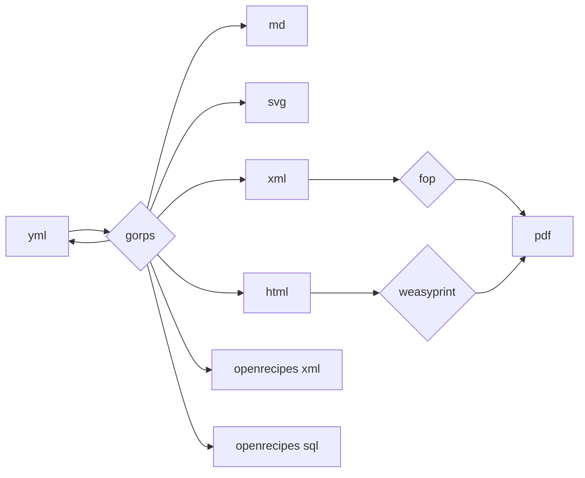

<div align="center">

{width=25%}

[](https://pypi.org/project/gorps)
[](https://pypi.org/project/gorps)
[](https://gitlab.com/g-braeunlich/gorps/-/commits/main)
[](https://www.gnu.org/licenses/gpl-3.0)
[](https://github.com/astral-sh/ruff)
[](https://mypy-lang.org/)


Conversion tool around a yml cooking recipe format.

[Install](#install) •
[Usage](#usage---examples)

</div>

# gorps

The idea: The format is simple enough so that an editor can be used
instead of a GUI and this script is intended to be a "mini [pandoc](https://pandoc.org/)"
for recipes.

About the name: there is a famous (unconfirmed)
[quote](https://1000-zitate.de/10395/Warum-ruelpset-und-furzet-ihr-nicht.html)
due to [Luther](https://en.wikipedia.org/wiki/Martin_Luther):
> Warum rülpset und furzet ihr nicht, hat es euch nicht geschmacket?

Translation:
> Why don't you burp and fart? Did it not taste good?

*Gorps* is the Swiss German word for *burp* (abuse of emoji
🗯 for the logo).

A typical recipe looks like:

```yml
title: Beans with Bacon a la Bud Spencer
description: Chuck Norris? Never heard about her!
instruction: |
  Finely dice the onion and briefly sauté in hot oil together
  with the bacon.
  ...
amount: 1
amount_unit: Pan
preparation_time: 900
cooking_time: 600
source: https://www.kabeleins.ch/sosiehtsaus/essen-trinken/rezepte/bohnen-mit-speck-nach-bud-spencer
link: https://www.kabeleins.ch/sosiehtsaus/essen-trinken/rezepte/bohnen-mit-speck-nach-bud-spencer
ingredients:
- name: Finely diced bacon
  amount: 125
  unit: g
- name: Clove of garlic
  amount: 1
- name: Salami or Cabanossi
  amount: 150
  unit: g
- name: ...
notes: |
  Bud gives a damn about cream, but if you prever, serve with cream!
tags:
  category:
  - Main course
```

An `amount` of an ingredient can be
* A number:
  ```yml
  - name: Clove of garlic
    amount: 1
  ```
* A fraction:
  ```yml
  - name: Clove of garlic
    amount: 1/3
  ```
* A range:
  ```yml
  - name: Clove of garlic
    amount:
      min: 2/3
      max: 1
  ```

Ingredients can be grouped:

```yml
ingredients:
  - name: Trimming
    ingredients:
      - name: ...
        amount: ...
        unit: ...
```

It is also possible to include an image:

```yml
image:
  fmt: image/jpeg
  data: !!binary |
    /9j/4AAQSkZJRgABAQAAAQABAAD/2wBDAAgGBgcGBQgHBwcJCQgKDBQNDAsLDBkSEw8UHRofHh0a
```

Where the binary data is the base64 encoded binary data of the image.

An image `/tmp/1x1.png` can be inserted into a recipe using

```sh
gorps set-image --pic=/tmp/1x1.png examples/recipes/yml/more-beans.yml
```

This will include the following in the yml file:

```yml
image:
  fmt: image/png
  data: !!binary |
    ...
```

where `...` is the base64 encoded content of the image file.
The image file can be encoded / decoded as follows:

```sh
# Encode:
base64 image.png > image.b64.txt
# Decode:
base64 -d image.b64.txt > image.png
```

An image also can be extracted from a recipe:

```sh
gorps extract-image -o /tmp/1x1.png examples/recipes/yml/more-beans.yml
```

## Supported Formats:

Import:
- Above `yml` format
- [Cooklang](https://cooklang.org/) `.cook` files (see below)
- [Gourmet](https://thinkle.github.io/gourmet/) `xml`

Export:
- The above `yml` format
- Markdown
- `svg`
- `xml` (via templates, e.g. XSL-FO xml output)
- [openrecipes](https://gitlab.com/ddorian/openrecipes/) sqlite and xml (not
  installed by default)
- `html`



## Install

Requirement: python >= 3.9.

```sh
pip install gorps
# or first clone / cd, then:
pip install .
```

With support for [openrecipes](https://openrecipes.jschwab.org):

```sh
pip install --install-option="--extras-require=openrecipes" gorps
# or first clone / cd, then:
pip install .[openrecipes]
```

## Cooklang support

### Import
[Cooklang](https://cooklang.org/) documents are imported as follows:
* Everything, except metadata (lines starting with `>> `), including
  comments is stored unchanged as the `instruction` field. The content
  type of the `instruction` is set to *cooklang*, so it can be
  properly formatted to other formats.
* Tagged ingredients (`@` and `{}`) and cookware (`#` / `{}`) are
  collected from the `instruction` field.
* The title is taken from the file name.
* If an image with extension *.jpg*, *.jpeg*, *.png* is present in the
  same folder as the *.cook* file, it is loaded as the image of the
  recipe.
* Every field name of the `Ingredient` class appearing in the
  metadata, will be passed to the `Ingredient` instance.
  Exceptions:
  - `ingredients`, `instruction`, `title`, `image`,
    `instruction_content_type`, `cookware` already are read in
    from outside the metadata. If one of the above mentioned keys are present in the
    metadata, the key / value will be stored in the `tags` field of
    the recipe.
  - `nutrition_labels`: Keys for values in nutrition labels have to be
    specified prefixed by `nutrition_labels.`, the values have to be
    of the form `number unit`. Example:
    ```
    >> nutrition_labels.Energy Value: 150 kcal
    ```
  Specialities:
  - `preparation_time` / `cooking_time`: The unit must be one
    of `h`, `min`, `sec` or the value must be formatted as `##:##:##`
    (3 `:`).
* Support for multivalued metadata entries (e.g. categories):
  Append `[]` to a key to put the value into a list. Example:
    ```
    >> category[]: Main dishes
    >> category[]: Starters
    ```
  will be loaded as `recipe.tags.category = ["Main dishes", "Starters"]`.

### Export

If a recipe has instruction content type *cooklang* (this is currently
only the case if it either has been imported from a *.cook* file or
from a *.yml* file where `instruction_content_type=text/cooklang`),
the `instruction` field is written without modification to the output
file followed by metadata. Otherwise all ingredient names / cookware
names appearing in the instruction as whole words (case insensitive)
will be marked up with cooklang tags. All ingredients / cookware not
found in the instructions will be appended to the cooklang file as a
list. Also here, metadata will be written at the end of the
file. Example:

```
Ingredients:

- @Finely diced bacon{125%g}
- @Clove of garlic{1}
...

Cookware:

- #Pan{}
...

>> description: Chuck Norris? Never heard about her!
...
```

## Usage - Examples

### svg

To export the folder [examples/recipes/yml/](./examples/recipes/yml/)` using a template [examples/svg/template.svg](./examples/svg/template.svg):

```sh
gorps export --template=examples/svg/template.svg -o /tmp/out.svg examples/recipes/yml/
```

### xml

In this advanced example, we compose the recipes from
[examples/recipes/yml/](./examples/recipes/yml/) to a menu card.

The template
[examples/menu-card/xml-fo/template.fo.xml](./examples/menu-card/xml-fo/template.fo.xml)
is used. This specific template expects to be used together with the
`--group-by` option (recipes should be grouped by category).
Also, we are specifying, that we only want to include the groups
*Starters*, *Main courses* and *Dessert* (`--group` options).
With the `--variable` option we pass to the template some other
required parameters, like logos for categories, fonts and more.
The example also shows, how to filter the source recipes by title
(`--title` options).

```sh
gorps export \
  --template examples/menu-card/xml-fo/template.fo.xml \
  --group-by 'tags["category"]' \
  --group Starters \
  --group "Main courses" \
  --group Dessert \
  --variable-file examples/menu-card/xml-fo/variables.json \
  --title "Beans with Bacon a la Bud Spencer" \
  --title "More Beans" \
  -o /tmp/menucard.fo.xml \
  examples/recipes/yml/
```

The resulting `fo.xml` can then be further processed by
[Apache fop](https://xmlgraphics.apache.org/fop/) to a pdf:

```sh
cp -r examples/menucard/img /tmp
fop /tmp/menucard.fo.xml /tmp/menucard.pdf
```

Note: The resulting xml file will refer to the fonts *Linux Libertine*
and *Linux Biolinum* which are part of the [Libertine Open Fonts Project](https://libertine-fonts.org/).

ℹ️ If you want to use custom fonts, you can specify a font config like
this:
```sh
fop -c fonts.cfg /tmp/menucard.fo.xml /tmp/menucard.pdf
```
where `fonts.cfg` looks like:

```xml
<?xml version="1.0"?>
<fop version="1.0">
  <renderers>
    <renderer mime="application/pdf">
      <fonts>
        <directory>/path/to/fonts</directory>
        <auto-detect/>
      </fonts>
    </renderer>
  </renderers>
</fop>
```

The template syntax is inspired by [vue.js](https://vuejs.org/):
Currently, the following directives are implemented:
* [Text
  Interpolation](https://vuejs.org/guide/essentials/template-syntax.html#text-interpolation)
  ```html
  <span>Title: {{ recipe.title }}</span>
  ```
* [v-if](https://vuejs.org/api/built-in-directives.html#v-if)
  (Conditionally render an element based on the truthy-ness of the expression value)
  ```html
  <div v-if="recipe.ingredients">
    {{ recipe.title }}
  </div>
  ```
* [v-for](https://vuejs.org/api/built-in-directives.html#v-for)
  (Render the element block multiple times based on the source data)
  ```html
  <div v-for="recipe in recipes">
    {{ recipe.title }}
  </div>
  ```
  Tuple unpacking is also possible:
  ```html
  <div v-for="group, recipes in groups.items()">
    {{ group }}: {{ recipes[0].title }}
  </div>
  ```
* [v-bind](https://vuejs.org/api/built-in-directives.html#v-bind)
  (Dynamically bind one or more attributes to an element)
  ```html
  <!-- bind an attribute -->
  <a v-bind:href="recipe.link">Link</a>

  <!-- bind a dict of attributes -->
  <div v-bind="{ 'id': '1', 'class': 'X'}"></div>
  ```
* `<template>` on
  [v-if](https://vuejs.org/guide/essentials/conditional.html#v-if-on-template)
  and
  [v-for](https://vuejs.org/guide/essentials/list.html#v-for-on-template)

### html

#### Menu card

This is a slight variant of the xml fo example from above.
This time, we use html as output format and make use of the
`--grouped-titles` option, to manually group recipes by their titles.
Also, `--filter-ingredient` is used, to remove "obvious" ingredients
from the ingredient list.

```sh
gorps export \
  --template examples/menu-card/html/menucard.template.html \
  -V title="Beans & Beans" \
  --filter-ingredient Salt \
  --filter-ingredient Pepper \
  --grouped-titles examples/menu-card/html/grouped_titles.json \
  -o /tmp/menucard.html \
  examples/recipes/yml/
```

The resulting html can be further processed to a pdf by
e.g. [weasyprint](https://doc.courtbouillon.org/weasyprint/stable/):

```sh
cp -r examples/menucard/img examples/menucard/html/style.css /tmp
weasyprint /tmp/menucard.html /tmp/menucard.pdf
```

Note: see the comment about fonts from the xml fo example.

#### web

Here, we export a recipe to html, using the same template syntax as
for xml:

```sh
gorps export \
  --template examples/html/template.html \
  -o /tmp/beans.html \
  examples/recipes/yml/beans.yml
```


### openrecipes

There are two possibilities: either direct export to the sqlite
database file or export to an `.openrecipe` xml file.

#### sql

To sync to an openrecipes db on an android phone, first pull the db
via adb:

```sh
adb root
adb pull /data/user/0/org.jschwab.openrecipes/files/database.db /tmp/
```

Then export all recipes to the sqlite db:

```sh
gorps export --fmt openrecipes -o /tmp/database.db examples/recipes/yml/
```

Finally, replace the db on the phone with the extended version:

```sh
adb push /tmp/database.db /data/user/0/org.jschwab.openrecipes/files/database.db
adb kill-server # terminate adb
```

#### openrecipe xml

```sh
gorps export --fmt openrecipes-xml -o /tmp/out/ examples/recipes/yml/
```

### markdown

To export the folder [examples/recipes/](./examples/recipes/) to
individual `.md` files in `/tmp/out/`:

```sh
gorps export --fmt markdown -o /tmp/out/ examples/recipes/yml/
```
