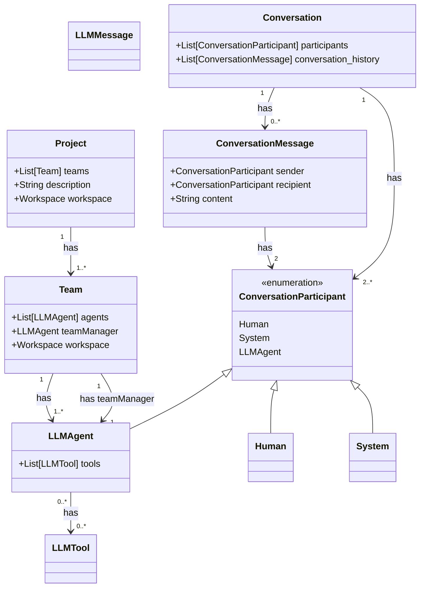
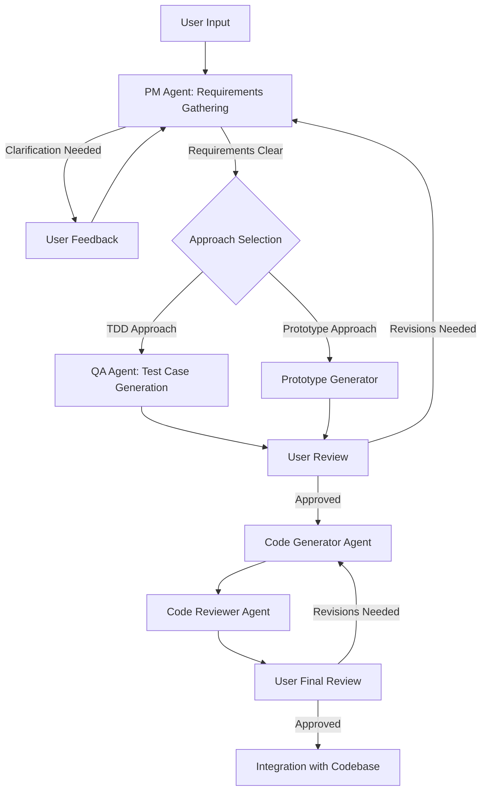
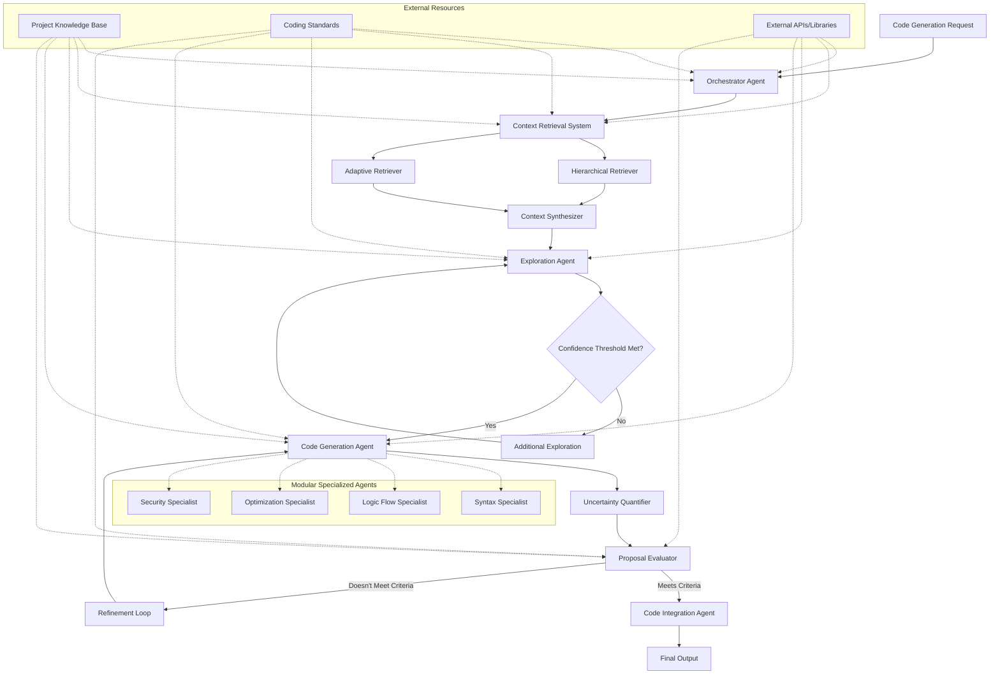

# open-llm-swe

Note: This README is outdated - Much of the improvements is now focused on the team and conversation aspect.

This project explores various concepts to enhance the performance of Large Language Model (LLM) agents in producing code for non-trivial codebases. We have identified several key challenges that LLMs face when tasked with software development.

# Data Model

[memaid](docs/data_model.mermaid)




## Identified Challenges

### 1. Limitations in Handling Large Codebases

LLMs are constrained by their context window, which limits the amount of information they can process at once. This presents significant challenges when dealing with large, complex codebases:

- **Limited context window**: LLMs can only reason within a finite amount of input text, making it difficult to understand extensive codebases in their entirety.
- **Computational and financial costs**: Even if we could feed an entire codebase into the context, it would incur substantial computational and financial expenses.
- **Inefficient information retrieval**: Basic retrieval-augmented generation (RAG) might not be sufficient for accurately finding and utilizing relevant code snippets. Using embeddings to retrieve fixed-size chunks might be too simplistic due to the limitations in embedding matching accuracy.

To mitigate these issues, we need to develop tools that allow LLMs to efficiently navigate large codebases, similar to how human developers use abstractions to work within their limited working memory. For instance:

- Providing only the required information to the LLM based on the task at hand (e.g., directory structure for deciding where to place a utility subroutine, or specific code sections for debugging).
- Creating sophisticated retrieval mechanisms that can accurately locate and present relevant code snippets to the LLM.

### 2. Inherent Limitations of LLM Behavior

Several aspects of LLM behavior can impede their effectiveness in software development tasks:

1. **Overreliance on initial outputs**: LLMs tend to provide quick initial responses, which may not always be the most accurate or well-thought-out solutions.

2. **Reluctance to provide negative or empty answers**: LLMs might struggle to admit when they don't have enough information or when no action is necessary.

3. **Difficulty in maintaining long-term context**: LLMs may struggle to keep track of information across multiple interactions or code sections, leading to inconsistencies in larger projects.

4. **Lack of meta-cognitive abilities**: LLMs might have difficulty assessing their own understanding and capabilities in relation to the specific codebase they're working on.

5. **Uncertainty quantification**: LLMs may struggle to accurately express their level of certainty about their understanding or proposals, potentially leading to overconfident or unreliable outputs.


## Project Overview

Our approach divides the code generation process into two main phases:

1. Requirements Gathering
2. Code Generation

We incorporate several advanced concepts to improve the overall performance and reliability of the system.

### Requirements Gathering Process

<!--  -->



The requirements gathering phase involves:

- PM Agent for clarifying and refining user requirements
- Approach selection between Test-Driven Development (TDD) and Prototype-First development
- User review and feedback loops

### Advanced Code Generation System

<!--  -->



The code generation phase incorporates several concepts:

1. **Hierarchical Retrieval**: Efficiently manages large codebases by fetching context at different levels of abstraction.

2. **Iterative Exploration**: Ensures thorough understanding of the codebase before code generation begins.

3. **Confidence Threshold**: Prevents premature code generation by ensuring sufficient understanding of the task and context.

4. **Explicit Uncertainty Quantification**: Helps identify areas that may need human attention or further refinement.

5. **Unknown State Handling**: Improves the system's ability to acknowledge and work with incomplete information.

6. **Modular Architecture**: Utilizes specialized agents for different aspects of code generation, such as syntax, logic flow, optimization, and security.

7. **Adaptive Retrieval**: Improves relevance of retrieved information over time through learning.

8. **Context Synthesis**: Combines and summarizes retrieved information for efficient use by other components.

9. **Proposal Evaluation**: Assesses generated code against project requirements and standards.

10. **Refinement Loop**: Allows for iterative improvement of generated code based on evaluation results.

## Getting Started

The project uses [poetry](https://python-poetry.org/) as the python package manager and builder. It uses NPM as the package manager for JS.

Only Anthropic is supported as the backing LLM API for now, although support for the other LLM APIs can be added relatively easily if there is demand for it.


### LLM Sonder

src is the python API behind the agent, conversation and team creation. 

Installing packages:

```bash
poetry install
```

Creating a basic agent to play around with

```bash
poetry run python -m src.agents.basic_agent
```

Creating an LLM team

```bash
poetry run python -m src.agents.team_creator_agent
```

### Agent Dashboard

agent_dashboard currently houses the Web UI for the project.

This is comprised of the following

1. AgentTrace - The monitoring dashboard for generated messages 
2. Conversations - Creating conversations and messages using the web UI.

Installing packages:

```bash
cd agent_dashboard/frontend
npm install
```

Running the backend:

```bash
poetry run python -m agent_dashboard.backend.server
```

Running the frontend:

```bash
cd agent_dashboard/frontend
npm run dev
```


## Contributing

### Conventions

1. All serializable objects expose `to_dict` and `from_dict` methods
2. The serialized object contain a `class_name` key to identify the original object


## License

(Include license information here)

## Contact

Feel free to contact me at zhuweiji1997@gmail.com or raise an issue on the github repo!
