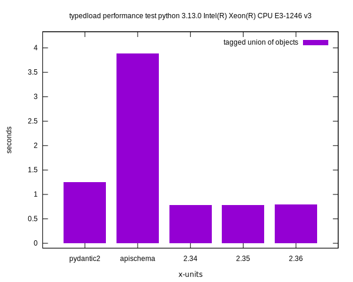
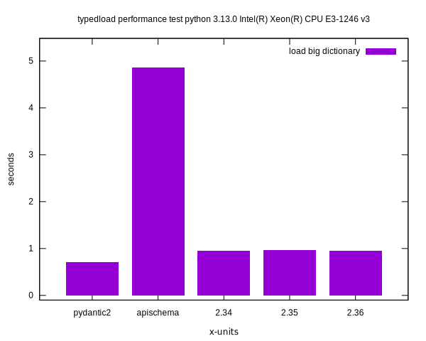
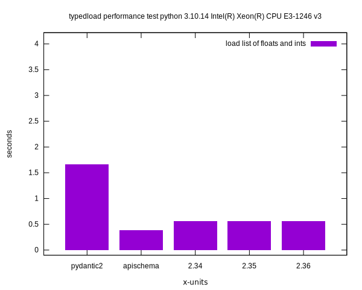
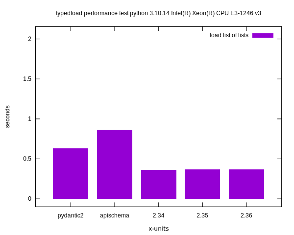
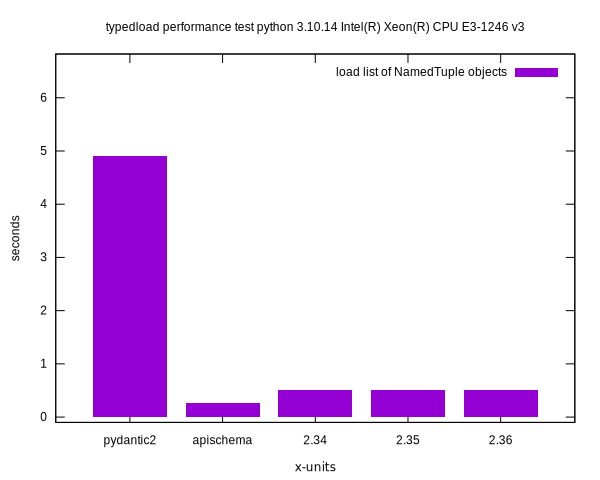

Performance
===========

Negative values mean that the library failed the test.

The tests are done on my PC. The following libraries are tested:

* `typedload`, the 3 most recent versions. It shines with tagged unions, which is what I mostly use.
* `pydantic2` years of work to rewrite it in Rust, [implemented detection of tagged unions years after I did it](https://github.com/pydantic/pydantic/issues/5163#issuecomment-1619203179), still managing to lose some benchmarks 😅
* `apischema` is slower where there are unions, faster otherwise

Using Python 3.13
-----------------







Using Pypy 7.3.17
-----------------







Run the tests
-------------

Generate the performance chart locally.

```bash
python3 -m venv perfvenv
. perfvenv/bin/activate
pip install apischema pydantic attrs
export PYTHONPATH=$(pwd)
make gnuplot
```
